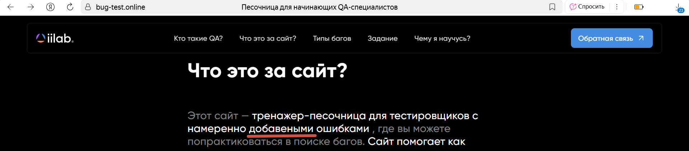

# Опечатка в разделе «Что за сайт?» — слово «добавленными» написано как «добавеными»

**ID:** BUG-002
**Приоритет:** Low
**Серьёзность:** Trivial
**Окружение:**

- Браузер: Яндекс Браузер 25.4.4.576
- ОС: Windows 11 23H2

## Предусловия

- Открыть сайт [bug-test.online](https://bug-test.online).

## Шаги воспроизведения

1. Перейти на главную страницу сайта.
2. Прокрутить страницу вниз до раздела «Что за сайт?».
3. Обратить внимание на текст описания.

## Ожидаемый результат

- Слово «добавленными» отображается корректно.

## Фактический результат

- В тексте присутствует опечатка: написано «добавеными».

## Вложения
