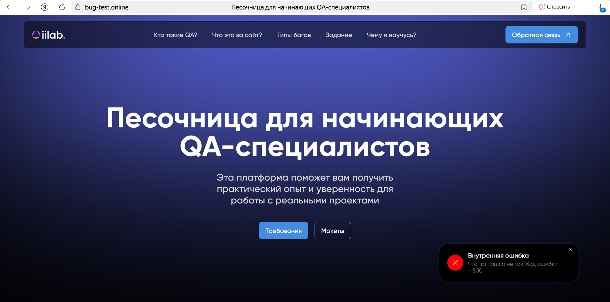

# Ошибка 500 при нажатии на иконку iilab

**ID:** BUG-001
**Приоритет:** High
**Серьёзность:** Major
**Окружение:**

- Браузер: Яндекс Браузер 25.4.4.576
- ОС: Windows 11 23H2

## Предусловия

- Пользователь открыл сайт [bug-test.online](https://bug-test.online).
- Авторизация не требуется.

## Шаги воспроизведения

1. Перейти на главную страницу сайта.
2. Нажать на иконку iilab в левом верхнем углу (логотип сайта).

## Ожидаемый результат

- Пользователь возвращается на главную страницу сайта.
- Страница корректно загружается без ошибок.

## Фактический результат

- Отображается ошибка 500 (Internal Server Error).
- Ошибка не убирается до обновления страницы.

## Вложения
